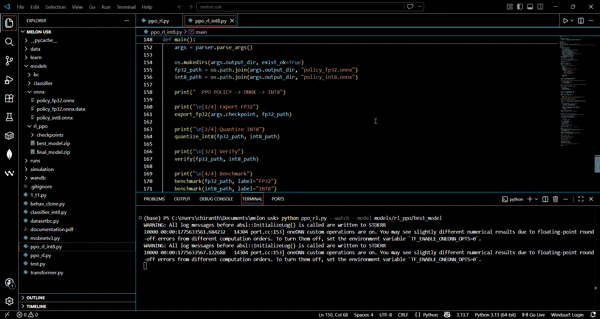
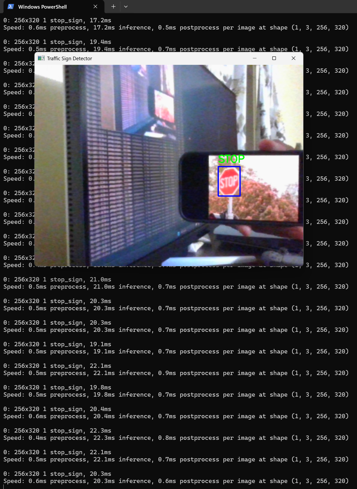

# AutoVision-AI — Autonomous Driving on Raspberry Pi

An end-to-end autonomous driving system built from scratch: custom Gymnasium simulation, Transformer + LSTM + RecurrentPPO policy trained with behavioral cloning warm-start, and a MobileNetV3-Small traffic sign classifier — all exported to INT8 ONNX and deployed on a Raspberry Pi 4.

---

## Demo

### Simulation — PPO Policy Running Live


### On-Device Inference — Raspberry Pi 4 (After Optimisation)


### Stop Sign Detection (INT8 ONNX, ~20ms inference)


---

## Architecture Overview

```
Sensor Observations (15 features)
        │
        ▼
TransformerFeatures  ←── Behavioral Cloning warm-start
  (2-layer, d=32, 4-head MHA)
        │
        ▼
     LSTM (64 hidden)     ←── Temporal memory across timesteps
        │
        ▼
  Action Head (5 actions)
        │
   RecurrentPPO           ←── Fine-tuned with 2M environment steps
```

The 15 observation features fed to the policy are:

| Index | Feature | Description |
|-------|---------|-------------|
| 0–2 | `us_left/center/right` | Ultrasonic raycasts (normalised 0–1) |
| 3 | `speed_pwm` | Current speed normalised to `MAX_SPEED` |
| 4 | `lane` | Lateral position estimate |
| 5–6 | `obstacle_bin/dist` | Static obstacle detected + distance |
| 7–9 | `oncoming_bin/dist/speed` | Oncoming vehicle detection |
| 10–11 | `lhs_safe/rhs_safe` | Left/right lane clearance |
| 12 | `traffic_signal` | Red=0.0, Yellow=0.5, Green=1.0 |
| 13 | `obstacle_pass` | Whether the obstacle has been passed |
| 14 | `stop_sign` | Stop sign detection flag |

---

## Training Pipeline

### 1. Expert Data Generation

```bash
cd training
python datasetbc.py
```

Runs a hand-crafted `ExpertPolicy` (rule-based) for 500 episodes inside the custom Gymnasium environment. Only successful episodes (obstacle passed) are saved. Outputs `data/expert/states.npy` and `data/expert/actions.npy`.

### 2. Behavioral Cloning

```bash
python behav_clone.py
```

Trains the `TransformerFeatures` extractor via supervised learning on the expert demonstrations. 30 epochs, StepLR scheduler, CrossEntropyLoss. Best checkpoint saved to `models/bc/best_bc.pth`. Achieves **~99.5% validation accuracy**.

### 3. Recurrent PPO

```bash
python ppo_rl.py           # train
python ppo_rl.py --watch   # watch trained agent
```

Loads BC weights into the PPO feature extractor, then fine-tunes with `sb3_contrib.RecurrentPPO` across 2M timesteps on 8 parallel `SubprocVecEnv` workers. The LSTM is trained only during this stage.

Key hyperparameters:

| Parameter | Value |
|-----------|-------|
| `n_steps` | 128 |
| `batch_size` | 64 |
| `gamma` | 0.99 |
| `gae_lambda` | 0.95 |
| `clip_range` | 0.2 |
| `ent_coef` | 0.05 |
| LSTM hidden size | 64 |

### 4. Traffic Sign Classifier

```bash
python mobnetv3.py
```

Fine-tunes MobileNetV3-Small (pretrained on ImageNet) to classify `green` / `red` / `stop_sign`. First 40 feature layers frozen. CosineAnnealingLR, AdamW, label smoothing, early stopping with patience=10.

---

## Deployment (ONNX + INT8)

### Classifier → INT8

```bash
cd deployment
python classifier_int8.py \
    --checkpoint models/classifier/best_classifier.pth \
    --output_dir onnx/ \
    --data_dir data/traffic_signs
```

Uses **static quantisation** (QDQ format, per-channel) with a `CalibrationDataReader` sampling 100 images per class. Achieves ~20ms inference at (1, 3, 96, 96) on Pi 4.

### PPO Policy → INT8

```bash
python ppo_rl_int8.py \
    --checkpoint models/rl_ppo/final_model.zip \
    --output_dir onnx/
```

Uses **dynamic quantisation** (variable activations, no fixed calibration dataset). The ONNX wrapper exposes LSTM state (`h_in`, `c_in`) as explicit inputs/outputs so the stateful inference loop works correctly at runtime.

---

## Repository Structure

```
autonomous-car-software/
├── simulation/
│   ├── __init__.py
│   └── environment.py        # Custom Gymnasium env (pygame renderer, raycasting, reward shaping)
├── training/
│   ├── transformer.py        # TransformerFeatures (BaseFeaturesExtractor for SB3)
│   ├── datasetbc.py          # Expert policy + dataset generation
│   ├── behav_clone.py        # BC training loop
│   ├── ppo_rl.py             # RecurrentPPO training + watch mode
│   └── mobnetv3.py           # MobileNetV3-Small classifier
├── deployment/
│   ├── classifier_int8.py    # FP32→ONNX→INT8 for classifier
│   └── ppo_rl_int8.py        # FP32→ONNX→INT8 for PPO policy
├── onnx/
│   ├── classifier_fp32.onnx
│   ├── classifier_int8.onnx
│   ├── policy_fp32.onnx
│   └── policy_int8.onnx
├── obtained models/
│   ├── best_bc.pth
│   ├── best_classifier.pth
│   └── best_model.zip
└── data/
    ├── expert/               # states.npy + actions.npy
    └── val/                  # Validation images (stop_sign, green, red)
```

---

## Environment Details

The custom `autonomous-driving-v1` Gymnasium environment simulates a 3-lane road (600×800px) with:

- **Static obstacle** (broken truck in centre lane + barrier in right lane)
- **Oncoming vehicle** approaching in the left lane at randomised speed
- **Raycasting** at −35°, 0°, 35° for ultrasonic sensor simulation
- **Domain randomisation** (obstacle positions, oncoming speed) during training
- **Reward shaping**: forward progress, obstacle pass bonus (+50), goal bonus (+200), collision penalty (−200), dangerous merge penalty (−20), lane-centering penalty post-overtake

Action space: `{STOP, FORWARD, FORWARD_SLOW, STEER_LEFT, STEER_RIGHT}`

---

## Requirements

```bash
pip install torch torchvision gymnasium stable-baselines3 sb3-contrib \
            onnx onnxruntime pygame numpy
```

For Raspberry Pi deployment:
```bash
pip install onnxruntime picamera2
```

---

## Hardware

| Component | Detail |
|-----------|--------|
| Compute | Raspberry Pi 4 (4GB) |
| Camera | Pi Camera v2 |
| Sensors | HC-SR04 Ultrasonic (×3) |
| Motors | TB6612FNG motor driver + 4WD chassis |
| Training GPU | NVIDIA RTX 4060 (CUDA 12.8) |
